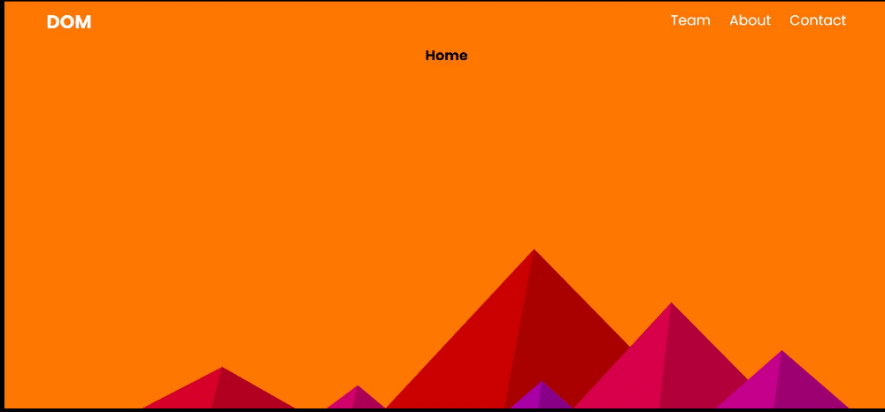

# Task 3

Date: **2nd June'2021**\
Day: **Wednesday**\
Topics: **HTML & CSS**

It is **group** activity.

Create a DOM Team website as following GIF:

- It should have main landing page.
- A Team Page, where there will be card of each member.
- About Page.
- Contact Page.

## Assets:

- Font: https://fonts.googleapis.com/css2?family=Poppins:ital,wght@0,100;0,200;0,300;0,400;0,500;0,600;0,700;0,800;0,900;1,100;1,200;1,300;1,400;1,500;1,600;1,700;1,800;1,900&display=swap
- Background Image: https://www.svgbackgrounds.com/
